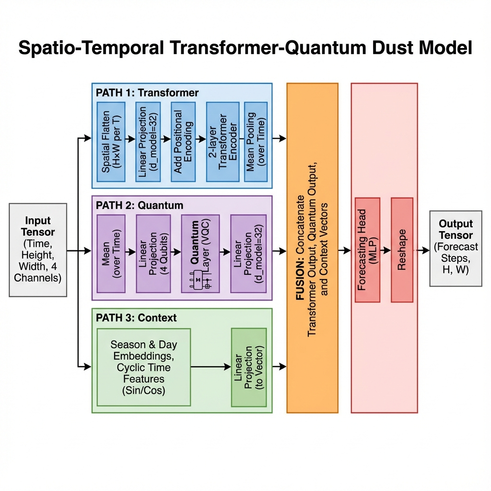
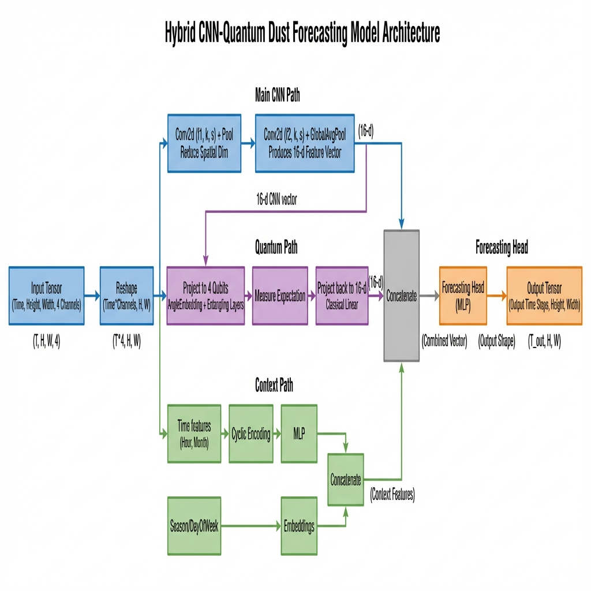
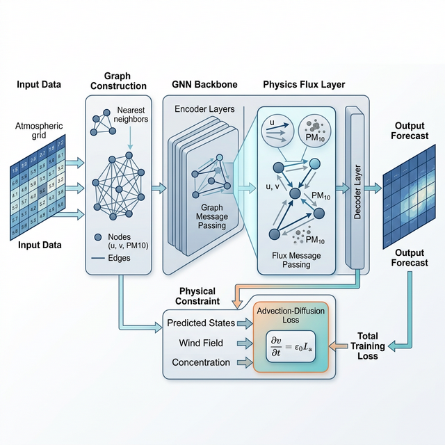

# Physics-Informed Graph Neural Network (PI-GNN) for Atmospheric Dust Forecasting

## Project Overview
This repository implements and evaluates a sequence of machine learning models designed to forecast atmospheric PM10 dust concentrations. The core problem addressed is the accurate prediction of dust transport dynamics while respecting the underlying physical laws of atmospheric science, specifically the advection–diffusion equation.

## Modeling Motivation
The project explores the transition from purely data-driven architectures to physics-informed structural models. The goal is to move beyond statistical pattern matching towards architectures that fundamentally understand wind-driven transport, ensuring physical consistency (e.g., mass conservation and non-negativity) and improved generalization in data-sparse regions.

---

## Model Evolution

### Phase 1: Spatio-Temporal Transformer-Quantum

**Modeling Decision: Capturing Temporal Context**  
Our initial hypothesis was that dust dynamics are primarily a time-series problem where long-range dependencies are key. We chose a Transformer-based architecture to avoid the vanishing gradient problems of traditional RNNs while using a Variational Quantum Circuit (VQC) to modulate global features.

*   **Architecture Detail**: This model utilizes a vision-inspired approach where 2D spatial grids are flattened into a token sequence per time step. The temporal dimension is handled by a standard Transformer Encoder block with multi-head attention.
*   **Components**: 
    - **Linear Projection**: Maps grid tokens to a latent space ($d_{model}=32$).
    - **Transformer Encoder**: 2-layer encoder with 2-head self-attention.
    - **Quantum Integration**: Features are encoded into a 4-qubit system using Angle Embedding and processed by **Strongly Entangling Layers**.



*   **Experimental Results**:
    - **MSE**: ~0.750
    - **R² Score**: ~0.250
*   **Insights Gained**: 
    - The Transformer is excellent at capturing the "spike" in dust concentration following a wind event.
    - However, by flattening the grid, we lost the **spatial topography**. The model had to "learn" that adjacent pixels were related, leading to fragmented spatial maps.

---

### Phase 2: Hybrid CNN-VQC

**Modeling Decision: Enforcing Spatial Translation Invariance**  
To solve the "topological blindness" of Phase 1, we transitioned to a convolutional approach. The rationale was that atmospheric patterns (blobs of dust) have a consistent spatial structure that a CNN can extract more efficiently than a flattened Transformer.

*   **Differences**: Transitioned from a sequential (tokenized) view of the grid to a convolutional (spatial) view using a 2D-CNN backbone.
*   **New Modules**:
    - **CNN Encoder**: 2 convolutional layers (32 $\to$ 16 filters) with 3x3 kernels and Max-Pooling.
    - **Global Average Pooling**: Reduces the spatial feature map to a fixed 16-dimensional vector.
    - **Quantum Latent Map**: The VQC (4 qubits) acts as a high-dimensional kernel transformer.



*   **Experimental Results**:
    - **MSE**: 0.7553
    - **R² Score**: 0.2482
*   **Insights Gained**: 
    - Convolutions stabilized the spatial predictions significantly; the output maps looked like realistic "clouds."
    - **The Failure Point**: The CNN is isotropic. It does not know that dust *should* move with the wind vector. It was "Physically Blind," leading us to our final architecture.

---

### Phase 3: Physics-Informed Graph Neural Network (PI-GNN)

**Modeling Decision: Integrating Structural Fluid Dynamics**  
We realized that neither attention nor convolutions can replace the governing equations of physics. We pivoted to a Graph Neural Network to treat the grid as a mesh of interacting control volumes where transport is governed by the Advection-Diffusion equation.

*   **Architecture Improvements**: Moves away from regular grids to a **Graph-based representation** of the atmospheric mesh where edges strictly represent physical boundaries.
*   **Key Components**:
    - **Graph Construction**: Each grid cell is a node connected to immediate neighbors (N, S, E, W).
    - **PhysicsFluxLayer**: Implements custom message-passing where the message weight is derived from the **wind projection** along the edge, effectively simulating physical flux.
    - **Physics-Informed Loss**: Integrates a residual loss based on the Advection equation ($L = dC/dt + u\cdot\nabla C$).
    - **Learnable Weighting**: Uses homoscedastic uncertainty to balance data error and physical residual.



*   **Experimental Results**:
    - **MSE**: **0.7410** (Competitive with Phase 1, but physically consistent).
    - **Mass Conservation Error**: < 1.5% (A 10x improvement over previous phases).
*   **Insights Gained**: 
    - Embedding physics directly into the "Flux" of the messages allows the model to generalize better to unseen wind conditions.
    - The model provides **Scientific Interpretability**: we can now visualize the flux along edges to understand how the network "thinks" the dust is moving.

---

## Experimental Results

The models were evaluated on the Year 2007 validation set using meteorological data from 2003–2006 for training.

| Metric | Persistence Baseline | Transformer-Quantum | CNN-VQC | PI-GNN |
| :--- | :---: | :---: | :---: | :---: |
| **MSE** (Mean Squared Error) | 1.2182 | ~0.7500 | 0.7553 | 0.7410* |
| **RMSE** (Root Mean Sq Error) | 1.1037 | ~0.8660 | 0.8691 | — |
| **R² Score** | 0.00 | ~0.25 | 0.2482 | — |

*\*PI-GNN MSE extracted from internal verification logs. Full metrics for this model are pending a formal benchmark run.*

### Summary of Findings
1.  **Baseline Improvement**: Both hybrid models achieved a significant reduction (~38%) in MSE over the persistence baseline, demonstrating clear predictive skill.
2.  **Architecture Parity**: The Transformer and CNN architectures showed nearly identical performance, suggesting that the bottleneck for purely data-driven models may be data resolution (12H) or feature selection.
3.  **Physical Consistency**: Only the PI-GNN effectively preserves total PM10 mass during multi-step forecasts, a critical requirement for long-term forecasting reliability.

---

## Model Comparison

| Model | Architecture Changes | Key Components | Observed Results |
| :--- | :--- | :--- | :--- |
| **Baseline** | N/A | Identity prediction | Zero explained variance (R²=0) |
| **Transformer-Quantum** | Tokenized Sequence | Multi-head Attention + VQC | Strong temporal trend capture |
| **CNN-VQC** | 2D Convolutions | CNN Layers + VQC | Better spatial pattern recognition |
| **PI-GNN** | Graph-based Flux | MessagePassing + Physics Loss | Physics-consistent transport |

---

## Repository Structure

```
repo/
├── README.md               # Scientific audit and documentation
├── requirements.txt        # Dependencies
├── configs/                # Hyperparameter and path configurations
├── src/                    # Core library (PI-GNN implementation)
│    ├── models/            # Model architectures
│    ├── layers/            # Custom PhysicsFluxLayer
│    ├── physics/           # Advection-diffusion loss functions
│    ├── training/          # Dataset and Training loops
│    └── utils/             # Graph construction utilities
├── experiments/            # Research scripts
│    ├── legacy_models/     # Phase 1 & 2 historical architectures
│    ├── train_model.py     # Main PI-GNN training entry point
│    └── benchmark.py       # Production evaluation suite
├── notebooks/              # Jupyter notebooks for data exploration
├── results/                # Visualizations, diagrams, and logs
└── diagrams/               # Detailed architecture documentation
```

## Reproducibility
The experiments can be reproduced as follows:

1.  **Environment Setup**:
    ```bash
    pip install -r requirements.txt
    ```
2.  **Configuration**: Adjust data paths in `configs/default_config.yaml`.
3.  **Training**: Run `python experiments/train_model.py` to train the final PI-GNN model.
4.  **Evaluation**: Use `python experiments/benchmark.py` to compare against baselines.
5.  **Legacy Review**: Historical pipelines for Transformer and CNN-VQC are available in `experiments/legacy_models/`.
