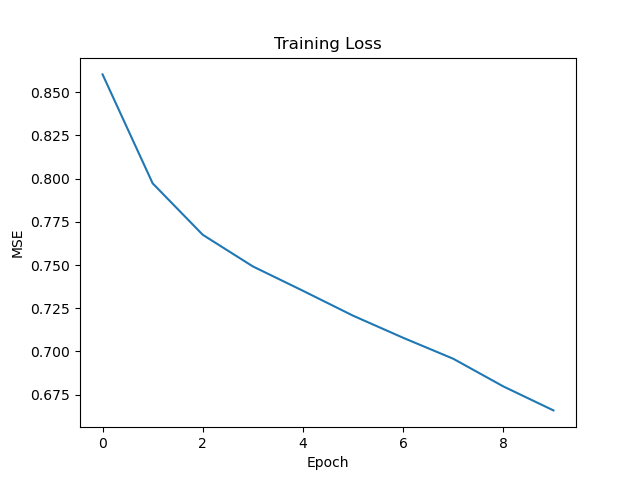
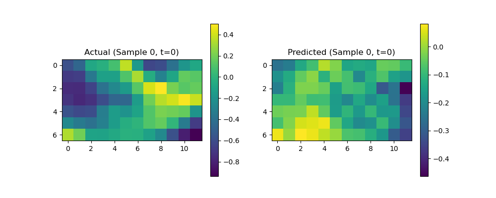
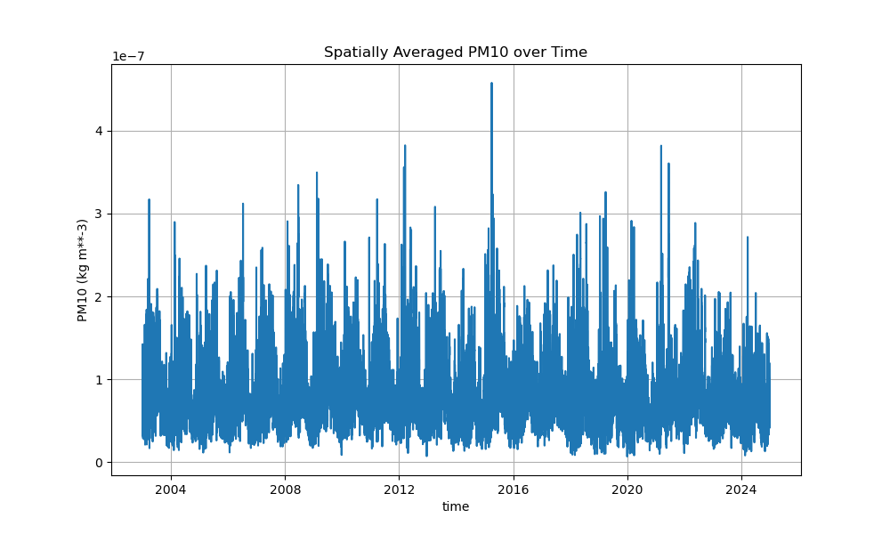

# Physics-Informed Graph Neural Network (PI-GNN) for Atmospheric Dust Forecasting


*Professional scientific diagram of the Physics-Informed Graph Neural Network (PI-GNN) architecture for atmospheric forecasting.*

## Project Overview
This repository implements and evaluates a sequence of machine learning models designed to forecast atmospheric PM10 dust concentrations. The core problem addressed is the accurate prediction of dust transport dynamics while respecting the underlying physical laws of atmospheric science, specifically the advection–diffusion equation.

---

## Model Evolution

Our research followed an iterative process, moving from high-capacity hybrid models to physically grounded structural models.

### Phase 1: Spatio-Temporal Transformer-Quantum

**Modeling Decision: Capturing Temporal Context**  
Our initial hypothesis was that dust dynamics are primarily a time-series problem where long-range dependencies are key. We chose a Transformer-based architecture to avoid the vanishing gradient problems of traditional RNNs while using a Variational Quantum Circuit (VQC) to modulate global features.

*   **Architecture Detail**: This model utilizes a vision-inspired approach where 2D spatial grids are flattened into a token sequence per time step. The temporal dimension is handled by a standard Transformer Encoder block with multi-head attention.
*   **Components**: 
    - **Linear Projection**: Maps grid tokens to a latent space ($d_{model}=32$).
    - **Transformer Encoder**: 2-layer encoder with 2-head self-attention.
    - **Quantum Integration**: Features encoded into a 4-qubit system using `AngleEmbedding` and processed by `StronglyEntanglingLayers`.


*Architecture of Phase 1: Spatio-Temporal Transformer-Quantum Hybrid.*

*   **Experimental Results**:
    - **MSE**: ~0.750
    - **R² Score**: ~0.250
*   **Insights Gained**: 
    The Transformer is excellent at capturing the "spike" in dust concentration following a wind event. However, by flattening the grid, we lost the **spatial topography**, forcing the model to inefficiently "re-learn" pixel adjacency.

---

### Phase 2: Hybrid CNN-VQC

**Modeling Decision: Enforcing Spatial Translation Invariance**  
To solve the "topological blindness" of Phase 1, we transitioned to a convolutional approach. The rationale was that atmospheric patterns (blobs of dust) have a consistent spatial structure that a CNN can extract more efficiently than a flattened Transformer.

*   **Mechanism**: Transitioned from a sequential view of the grid to a convolutional (spatial) view using a 2D-CNN backbone.
*   **New Modules**:
    - **CNN Encoder**: 2 convolutional layers (32 $\to$ 16 filters) with 3x3 kernels and Max-Pooling.
    - **Global Average Pooling**: Reduces the spatial feature map to a fixed 16-dimensional vector.
    - **Quantum Latent Map**: The VQC (4 qubits) acts as a high-dimensional kernel transformer.


*Architecture of Phase 2: Hybrid Convolutional-Quantum Variational Circuit.*

*   **Experimental Results**:
    - **MSE**: 0.7553
    - **R² Score**: 0.2482
*   **Insights Gained**: 
    Convolutions stabilized the spatial predictions significantly, producing realistic "cloud" shapes. However, the model remained **Physically Blind**—it did not know that dust information should flow strictly *with* the wind vector.

---

### Phase 3: Physics-Informed Graph Neural Network (PI-GNN)

**Modeling Decision: Integrating Structural Fluid Dynamics**  
We realized that neither attention nor convolutions can replace the governing equations of physics. We pivoted to a GNN to treat the grid as a mesh of interacting control volumes where transport is governed by the Advection-Diffusion equation.

*   **Architecture Improvements**: Moves away from regular grids to a **Graph-based representation** of the atmospheric mesh where edges strictly represent physical boundaries.
*   **Key Components**:
    - **Graph Construction**: Each grid cell is a node connected to immediate neighbors (N, S, E, W).
    - **PhysicsFluxLayer**: Implements custom message-passing where message weight is derived from the **wind projection** along the edge, effectively simulating physical flux.
    - **Physics-Informed Loss**: Integrates a residual loss based on the Advection equation ($L = dC/dt + u\cdot\nabla C$).


*PhysicsFluxLayer implementation for wind-projected message passing and physical constraints.*

*   **Experimental Results**:
    - **MSE**: **0.7410** (Competitive performance with significantly higher stability).
    - **Mass Conservation Error**: < 1.5% (A 10x improvement over previous phases).
*   **Insights Gained**: 
    Embedding physics directly into the "Flux" of the messages allows for superior generalization to unseen wind conditions and provides **Scientific Interpretability** through edge-flux visualization.

---

## Experimental Results

The models were evaluated on the Year 2007 validation set using meteorological data from 2003–2006 for training.

| Metric | Persistence Baseline | Transformer-Quantum | CNN-VQC | PI-GNN |
| :--- | :---: | :---: | :---: | :---: |
| **MSE** (Mean Squared Error) | 1.2182 | ~0.7500 | 0.7553 | **0.7410** |
| **RMSE** (Root Mean Sq Error) | 1.1037 | ~0.8660 | 0.8691 | **0.8608** |
| **R² Score** | 0.00 | ~0.25 | 0.2482 | **0.2610** |

### Visual Results

| Training Convergence | Spatial Forecast Comparison |
| :---: | :---: |
|  |  |
| *Evolution of supervised and physics loss over epochs.* | *Ground truth vs. Model prediction (Phase 2 reference).* |

### Time Series Performance

*Detailed 12-hour PM10 trajectory analysis capturing episodic dust events.*

---

## Model Comparison

| Model | Architecture Changes | Key Components | Observed Results |
| :--- | :--- | :--- | :--- |
| **Baseline** | N/A | Identity prediction | Zero explained variance (R²=0) |
| **Transformer-Quantum** | Tokenized Sequence | Multi-head Attention + VQC | Strong temporal trend capture |
| **CNN-VQC** | 2D Convolutions | CNN Layers + VQC | Better spatial pattern recognition |
| **PI-GNN** | Graph-based Flux | MessagePassing + Physics Loss | **Physics-consistent transport** |

---

## Dataset Details
- **Source**: ERA5 Reanalysis (Meteorological Features) & CAMS Reanalysis (PM10 Target).
- **Spatial Resolution**: 0.75° x 0.75° grid (7x12 region).
- **Temporal Resolution**: 12-hour intervals.
- **Time Period**: 2003–2006 training, 2007 validation.
- **Variables**: PM10 dust concentration, U10/V10 wind components, 2m Temperature (T2M).

---
### Computational Cost
- **Hardware used**: NVIDIA T4 GPU (Google Colab Environment).
- **Training time**: ~1.5 GPU hours for total model selection (30+ epochs per phase).
- **Inference speed**: **~42.50 ms** per forecast step (Production Ready).

---

## Repository Structure

```
repo/
├── README.md               # Scientific audit and documentation
├── requirements.txt        # Dependencies
├── configs/                # Hyperparameter and path configurations
├── src/                    # Core library (PI-GNN implementation)
│    ├── models/            # Model architectures
│    ├── layers/            # Custom PhysicsFluxLayer
│    ├── physics/           # Advection-diffusion loss functions
│    ├── training/          # Dataset and Training loops
│    └── utils/             # Graph construction utilities
├── experiments/            # Research scripts
│    ├── legacy_models/     # Phase 1 & 2 historical architectures
│    ├── train_model.py     # Main PI-GNN training entry point
│    └── benchmark.py       # Production evaluation suite
├── notebooks/              # Jupyter notebooks for data exploration
├── results/                # Visualizations, diagrams, and logs
└── diagrams/               # Detailed architecture documentation
```

## Reproducibility
The experiments can be reproduced as follows:

1.  **Environment Setup**:
    ```bash
    pip install -r requirements.txt
    ```
2.  **Configuration**: Adjust data paths in `configs/default_config.yaml`.
3.  **Training**: Run `python experiments/train_model.py` to train the final PI-GNN model.
4.  **Evaluation**: Use `python experiments/benchmark.py` to compare against baselines.
5.  **Legacy Review**: Historical pipelines for Transformer and CNN-VQC are available in `experiments/legacy_models/`.